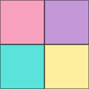

<p align="center">
  
</p>

<h1 align="center">Pixel Color Picker · 像素吸色器</h1>

<p align="center">
  <a href="https://chromewebstore.google.com/detail/pixel-color-picker-%E5%83%8F%E7%B4%A0%E5%90%B8%E8%89%B2%E5%99%A8/ekcbijfmpaglkgbdmiandakplmflanlo">
    
  </a>
  <a href="https://chromewebstore.google.com/detail/pixel-color-picker-%E5%83%8F%E7%B4%A0%E5%90%B8%E8%89%B2%E5%99%A8/ekcbijfmpaglkgbdmiandakplmflanlo">
    
  </a>
  <a href="https://github.com/vaxicy/pixel-color-picker/blob/main/LICENSE">
    
  </a>
</p>

<p align="center">
  A pixel-art style Chrome extension for picking colors from any web page.<br>
  Available to all users, with optional tips.
</p>

<p align="center">
  可爱的像素风网页取色工具 · 全免费 · 自由打赏
</p>

---

## Features · 功能特性

- Web color picking — one-click HEX / RGB / HSL from any pixel on the page
- Color collections — save favorites into palettes
- Palette management — create, rename, delete and reorder palettes
- 12 pixel-art themes — 少女粉 / 森林绿 / 夜空黑 / 鸢尾紫 / 燕麦咖 / 樱桃 / 游戏机 / 可可 / 薄荷 / 葡萄 / 迷雾蓝 / 奶油白 + custom theme editor (全部免费)
- Multi-format export — CSS variables, JSON, Tailwind config, PNG palette image
- Palette search — quickly find colors across history and palettes
- Dark mode — follows your system
- Bilingual UI — full zh-CN / en translations
- Local storage only — everything in `chrome.storage.sync`, no remote calls
- Optional donations — WeChat QR / PayPal link, your choice

网页取色（HEX/RGB/HSL）· 颜色收藏 · 色卡管理 · 12+ 套主题 · 多格式导出 · 色卡搜索 · 深色模式 · 中英双语 · 本地存储 · 自由打赏

## Install · 安装方法

### Option 1 · Chrome Web Store (recommended)

<p>
  <a href="https://chromewebstore.google.com/detail/pixel-color-picker-%E5%83%8F%E7%B4%A0%E5%90%B8%E8%89%B2%E5%99%A8/ekcbijfmpaglkgbdmiandakplmflanlo">
    
  </a>
</p>

一键安装，自动更新 — 推荐给普通用户。

### Option 2 · Load unpacked (developer mode)

1. Open Chrome and visit `chrome://extensions/`
2. Enable **Developer mode** in the top right
3. Click **Load unpacked**
4. Select this project folder
5. Done — the extension icon appears in the toolbar

## Usage · 使用方法

### Basic color picking

1. Click the **Pixel Color Picker** icon in the Chrome toolbar
2. Click **快速取色 / Quick Pick** in the popup
3. Click any pixel on a web page
4. The color is captured and saved to your palette

### Palette management

- **Create palette** — click `+` to add a new palette
- **Rename** — double-click a palette title
- **Delete** — right-click a palette
- **Export** — single palette exports to CSS / JSON / Tailwind / PNG

### Themes

- **Presets** — pick from 12 pixel-art themes
- **Custom theme** — adjust 4 color slots (header / button / background / panel) in settings, auto-saves as your theme
- **Reset** — one click to restore default

### Settings

Click the **Settings** button at the bottom of the popup:

- Default color format (HEX / RGB / HSL)
- Auto-save strategy
- Switch language (zh-CN / en)
- 12 themes + custom theme editor (all free)
- Data import / export / clear
- Support the author — optional WeChat QR / PayPal donation

## Tech stack · 技术栈

- **Manifest V3** — latest Chrome extension standard
- **Vanilla JavaScript** — no dependencies, no bundler
- **Chrome Storage API** — `chrome.storage.sync` for persistence
- **Canvas API** — for PNG palette export

## Project structure · 项目结构

```
color-picker/
├── manifest.json              # extension manifest
├── popup/                     # popup window (html/css/js)
├── background/                # background service worker
├── options/                   # settings page (html/css/js)
├── shared/                    # shared utilities (i18n)
├── images/                    # icons (16/48/128) + donate QR
├── _locales/                  # Chrome i18n (zh_CN + en)
│   ├── en/messages.json
│   └── zh_CN/messages.json
├── store-assets/              # Chrome Web Store assets
│   ├── icon.png
│   ├── promo-large-1400x560.png
│   ├── promo-small-440x280.png
│   └── store-description.txt
├── scripts/                   # packaging + screenshot scripts
└── README.md
```

## Privacy · 隐私

The extension runs **entirely locally**:

- All palettes and settings are stored in `chrome.storage.sync`, never sent to any server
- No remote code, no third-party analytics, no tracking
- Optional donation links go to `paypal.com` or WeChat QR — only triggered by user action, no information is collected

Full privacy policy: https://vaxicy.github.io/pixel-color-picker-privacy/privacy-policy.html

---

本扩展 **完全本地运行**：

- 所有色卡和设置存在 `chrome.storage.sync`，不会上传任何服务器
- 没有远程代码、没有第三方分析、没有追踪
- 可选打赏链接跳转到 `paypal.com` 或微信扫码 — 由用户主动触发，不收集任何信息

完整隐私政策：https://vaxicy.github.io/pixel-color-picker-privacy/privacy-policy.html

## License · 许可证

Non-Commercial License · 仅供个人非商业使用
See [LICENSE](LICENSE) for details.

详见 [LICENSE](LICENSE) 文件。

## Contributing · 贡献

Issues and pull requests are welcome.

欢迎提交 Issue 和 Pull Request！

## Changelog · 更新日志

The in-app changelog reads `version` from `manifest.json` automatically. 历史更新记录如下：

### v1.1.2 (2026-09-11)

- 主题系统重构 — extracted `shared/themes.js`, unified theme dropdowns in popup/options, fallback for missing color fields
- 新增三套主题 — Rose (烟熏玫瑰), Forest (苍松翠谷), Holly (冬青红果)
- 导出增强 — CSV / copy all HEX / Adobe ASE formats
- 历史记录增强 — favorite-to-top and full-history CSV export
- 取色后动作 — new "pick and close popup" option
- 文案修复 — fixed settings label typo where "Theme preset" was shown as "Header color"
- 取色历史修复 — delete buttons not responding, swatch compression; clear-history confirm replaced with inline pixel dialog
- 滚动条优化 — hidden scrollbars globally in popup, pixel-art scrollbar for changelog/history
- 取色入口调整 — removed global keyboard shortcut; kept popup button and right-click menu "Pick and save with Pixel"

### v1.1.1 (2026-08-06)

- 内置更新日志 — settings page shows a pixel-styled changelog popup, version auto-reads from manifest
- 反馈入口 — one-click feedback email inside the changelog popup
- 对比度修复 — white text in the pink-theme changelog popup was unreadable, now visible
- 悬浮态 bug — close button no longer vanishes / turns white on hover
- UI 简化 — removed donation entry from popup; donation only in options settings page

### v1.1.0 (2026-08-06)

- 移除 Pro 付费限制 — all themes, custom themes, and unlimited palettes are open to every user
- 新增打赏 — WeChat 赞赏码 / PayPal 付款链接（可选）
- 零远程 — removed all `host_permissions`; the extension no longer sends requests to any server
- 冗余清理 — removed 18+ Pro-related i18n strings and 4 Pro-limit interception points

### v1.0.0 (2026-06-07)

- 初始版本发布
- 基本取色 / 色卡 / 主题 / 导出 / 双语
